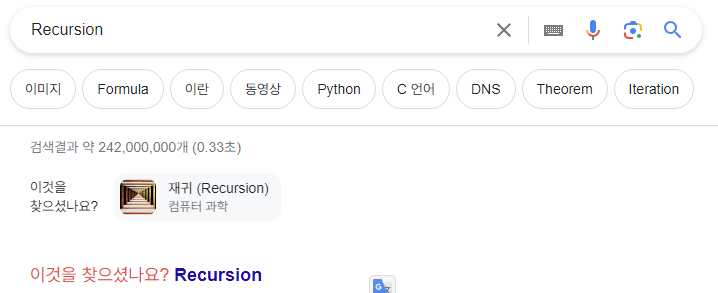

# oss 과제 1 마크다운 문법을 이용한 자기소개를 github에 git으로 업로드하기

## 20101288 정영훈

안녕하세요 저는 서울과기대 컴퓨터공학과에 재학중인 정영훈입니다.
코로나학기가 끝나고 이번학기에 복학하게되었는데 아는것은 별로없지만 열심히 배워 좋은 컴퓨터공학자가 되고 싶습니다.

강의중에 **재귀**가 프로그래밍 언어를 만들때 필요한 세가지 기둥중 하나라고 교수님께서 말씀하셨습니다.
다른 두가지 기둥은 무엇일지 궁금합니다. 구글링하면 나오겠지만 그렇게 찾아버리는것은 재미가 없을것 같습니다. 혼자 생각해보겠습니다.
아마 다음수업까지 알아내지못할것 같은데 강의중에 시간이 되신다면 알려주시면 감사하겠습니다.

```

```

마크다운 문법안에서 html이 된다는것도 모르고 있었는데 참 신기합니다.

<hr/>
위에는 줄 나누기 html 태그를 넣어봤는데 잘 작동할지 궁금합니다. vscode 편집기에서는 .md 파일이 바로 변환이 되어 보이지는 않는 것 같습니다. 아마 확장프로그램을 안깔서 그럴거 같습니다.

놀라운사실을 하나 알아냈는데 구글에다가 Recursion이라고 검색하면 '이것을 찾으셨나요?' 라고하면서 Recursion으로 가는 링크를 또 띄워줍니다. 일종의 이스터에그가 아닐까 싶습니다.



이 문서도 재귀로 끝나면 재밌겠네요. 혹은 재귀로 시작하는 것일까요?
Link: [Recursion][Recursion]

[Recursion]: https://github.com/younghun1124/oss 'Recursion'
